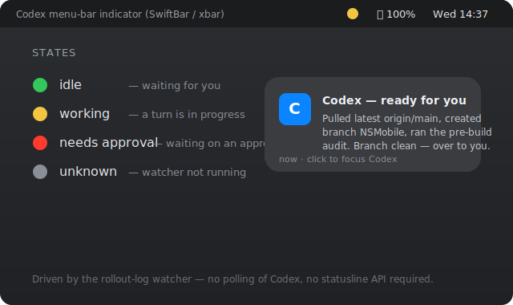

# codex-macos-status

Native macOS notifications and a menu-bar status indicator for the
[Codex CLI](https://github.com/openai/codex) — the same "your agent finished" /
"your agent needs you" feedback you get from Claude Code, but for Codex.

- 🔔 **Notification when a turn completes** — title *“Codex — ready for you”*,
  body = the assistant's final message.
- 🟢🟡🔴 **Menu-bar indicator** — **idle / working / needs approval**, refreshed ~1s.
- 🧩 Installs with one command, uninstalls cleanly, and **never blindly rewrites
  your `~/.codex/config.toml`**.



> The image above is a mockup. Record a real menu-bar GIF and drop it in at
> `docs/demo.gif` — see [docs/CAPTURE.md](docs/CAPTURE.md).

---

## How it works (and why)

Codex exposes two things a status tool could hang off of, and this project
deliberately uses the reliable one:

| Signal | What it gives | Problem |
| --- | --- | --- |
| `notify` hook in `config.toml` | Runs a program on discrete edges (mainly *turn ended*) | Fires only on edges — never reports *“started working.”* On the **sandboxed Codex Desktop** build it may not run third-party programs at all. |
| **Rollout logs** `~/.codex/sessions/**/rollout-*.jsonl` | A full, timestamped event stream per session | None — it's always written, on both the CLI and Desktop. |

So the backbone is a **log watcher** (`codex-watch`) that tails the most-recently
active rollout file, maps events to a state, writes one word to `~/.codex/state`,
and fires a notification when a turn completes. A tiny SwiftBar/xbar plugin reads
`~/.codex/state` and paints the menu bar. The `notify` hook is available as an
**optional** extra (see [below](#optional-the-notify-hook)) but nothing depends
on it.

**Events it reacts to** (discovered empirically — see
[schema discovery](#version--schema-discovery)):

| Rollout event (`event_msg.payload.type`) | State | Notification |
| --- | --- | --- |
| `task_started` | 🟡 working | — |
| `task_complete` (has `last_agent_message`) | 🟢 idle | ✅ “Codex — ready for you” |
| `turn_aborted` | 🟢 idle | — |
| anything matching `*approval*` / `*elicit*` (best-effort) | 🔴 needs approval | ✅ “Codex needs approval” |

Unknown events are ignored and unparseable lines hold the last state, so it
**degrades gracefully across Codex versions**.

---

## Requirements

- **macOS** (only — no Linux/Windows).
- **Codex CLI or Codex Desktop.** Tested against `codex-cli 0.144.2` (Desktop).
- **Python 3** — stock `/usr/bin/python3` is fine (no third-party packages). If
  missing: `xcode-select --install`.
- **Optional, recommended:** [`terminal-notifier`](https://github.com/julienXX/terminal-notifier)
  for click-to-focus + sound — `brew install terminal-notifier`. Without it the
  tool falls back to `osascript` (banners still work).
- **Optional:** [SwiftBar](https://github.com/swiftbar/SwiftBar) (or
  [xbar](https://github.com/matryer/xbar)) for the menu-bar indicator —
  `brew install --cask swiftbar`.

Notifications work with **zero** optional dependencies. The menu bar needs
SwiftBar/xbar.

---

## Install

```sh
git clone https://github.com/OWNER/codex-macos-status.git
cd codex-macos-status
./install.sh
```

That:
1. copies the runtime scripts into `~/.codex/codex-macos-status/`,
2. installs and loads a per-user **LaunchAgent** (`com.codex-macos-status.watcher`)
   that runs the watcher and restarts it if it dies,
3. copies the menu-bar plugin into your SwiftBar/xbar plugin folder **if** one is
   detected (otherwise it prints exactly where to put it),
4. seeds `~/.codex/state`.

**Turn-complete notifications are live immediately.** For the menu bar, install
SwiftBar and re-run `./install.sh` (or copy `plugins/codex-status.1s.sh` into your
plugin folder yourself).

### One-time SwiftBar setup

```sh
brew install --cask swiftbar
```

Open SwiftBar once and choose a plugins folder (e.g. `~/.swiftbar`). Re-run
`./install.sh` and the plugin drops in and appears within a second.

---

## Optional: the `notify` hook

The default install does **not** touch `config.toml`. If your Codex build *does*
run `notify` hooks and you want an extra edge-triggered notification:

```sh
./install.sh --with-notify-hook
```

This edits **only** the root `notify` key, and:

- **backs up** `config.toml` to `config.toml.bak.<timestamp>` first,
- **preserves any existing `notify`** by *chaining* — your previous hook still
  runs. For example, if you had:
  ```toml
  notify = ["/old/hook", "arg"]
  ```
  it becomes:
  ```toml
  notify = ["~/.codex/codex-macos-status/codex-notify-hook", "/old/hook", "arg"]
  ```
- refuses (and tells you) rather than touch a multi-line `notify` array,
- is undone exactly by `./uninstall.sh` (restores the backup).

> Note: on the sandboxed Codex **Desktop** build the `notify` hook may never fire
> for third-party programs — that's expected, and the watcher covers you anyway.

---

## Version / schema discovery

Codex's event names differ across versions, so nothing here is hard-coded from
memory — it's read from *your* logs. To see what your version actually emits:

```sh
# What states/notifications the watcher would produce for a past session:
python3 ~/.codex/codex-macos-status/codex-watch --replay \
  "$(ls -t ~/.codex/sessions/*/*/*/*.jsonl | head -1)"

# The state it infers for the current session, right now:
python3 ~/.codex/codex-macos-status/codex-watch --print-state
```

**If your version names the events differently** (e.g. a future `task_finished`
instead of `task_complete`), edit the small sets near the top of
[`bin/codex-watch`](bin/codex-watch):

```python
_START = {"task_started"}
_DONE  = {"task_complete"}
_ABORT = {"turn_aborted"}
```

Add your version's names to those sets and restart the watcher
(`launchctl kickstart -k gui/$(id -u)/com.codex-macos-status.watcher`). Approval
detection is substring-based (`*approval*` / `*elicit*`) so it usually needs no
change. PRs adding version names are welcome.

---

## Usage

Once installed there's nothing to run — the LaunchAgent keeps the watcher alive
across logins. The menu bar shows:

| Icon | Meaning |
| --- | --- |
| 🟢 | idle — Codex is waiting for you |
| 🟡 | working — a turn is in progress |
| 🔴 | needs approval — Codex is waiting on an approval (if your version emits one) |
| ⚪ | unknown / watcher not running (state file missing or >30s stale) |

### Configuration (environment variables)

Set these in the LaunchAgent (`~/Library/LaunchAgents/com.codex-macos-status.watcher.plist`,
under `EnvironmentVariables`) or your shell when running the watcher manually:

| Variable | Default | Purpose |
| --- | --- | --- |
| `CODEX_HOME` | `~/.codex` | Codex data dir (state, logs, sessions) |
| `CODEX_STATUS_NOTIFY` | `1` | `0` disables notifications (menu bar still works) |
| `CODEX_STATUS_SOUND_DONE` | `Glass` | Sound for turn-complete (`""` = silent) |
| `CODEX_STATUS_SOUND_APPR` | `Funk` | Sound for approval |
| `CODEX_STATUS_ACTIVATE` | auto | Bundle id focused on click (auto-detects ChatGPT.app) |
| `CODEX_STATUS_POLL` | `0.5` | Log poll interval (seconds) |

### Logs

```sh
tail -f ~/.codex/codex-macos-status/watcher.log
```

---

## Uninstall

```sh
./uninstall.sh          # remove everything, restore config.toml if it was changed
./uninstall.sh --purge  # also delete ~/.codex/state and notify*.log
```

It unloads and removes the LaunchAgent, removes the menu-bar plugin, restores
`config.toml` from the install-time backup (only if `--with-notify-hook` had been
used), and removes `~/.codex/codex-macos-status/`. Idempotent.

---

## Repository layout

```
codex-macos-status/
├── install.sh                  # idempotent installer (LaunchAgent + plugin [+ optional hook])
├── uninstall.sh                # idempotent uninstaller / reverter
├── bin/
│   ├── codex-watch             # the watcher: rollout logs -> state file + notifications
│   ├── codex-notifier          # send one mac notification (terminal-notifier -> osascript)
│   └── codex-notify-hook       # OPTIONAL config.toml notify-hook handler (best-effort)
├── plugins/
│   └── codex-status.1s.sh      # SwiftBar/xbar menu-bar plugin (reads ~/.codex/state)
├── tools/
│   ├── codex-config.py         # surgical, zero-dep config.toml editor (backup/diff/chain/restore)
│   └── codex-notify-logger     # discovery tool: log the raw notify JSON of your version
├── README.md
├── LICENSE                     # Apache-2.0
├── NOTICE
└── .gitignore
```

Runtime files (never committed): `~/.codex/state`, `~/.codex/codex-macos-status/watcher.log`,
and any `config.toml.bak.*`.

---

## Known limitations

- **`notify` fires only on edges.** It can't report *“started working,”* which is
  why the persistent indicator is built from rollout logs, not `notify`.
- **The indicator depends on the rollout log format**, which may change across
  Codex versions. The watcher ignores unknown events and holds state on parse
  errors, but a renamed `task_*` event needs a one-line edit (see
  [schema discovery](#version--schema-discovery)).
- **One session at a time.** The menu bar reflects the *most recently active*
  rollout file. With several Codex sessions running at once the indicator tracks
  whichever emitted an event last.
- **Sandboxed Desktop build.** The `notify` hook may not run third-party programs
  there; the watcher is unaffected.
- **Approval events are best-effort.** They were not observed on the tested
  version (which ran approval policy `never`), so 🔴 relies on a substring match
  that may need tuning on versions that do emit them.

---

## License

[Apache-2.0](LICENSE) © the codex-macos-status contributors. Not affiliated with
OpenAI; see [NOTICE](NOTICE).
