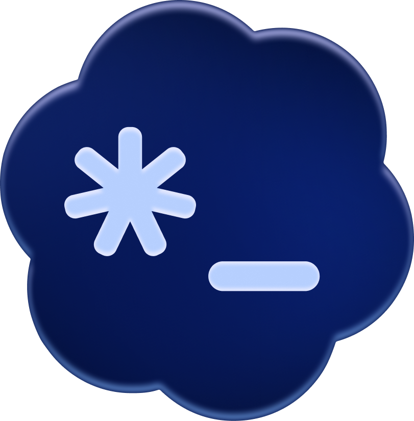
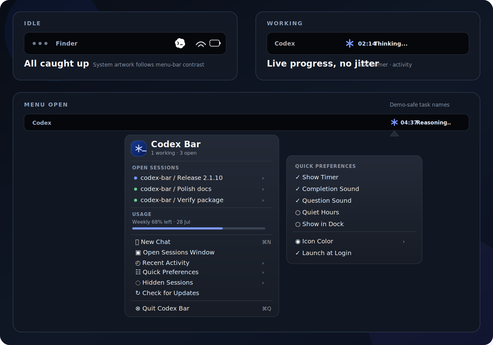
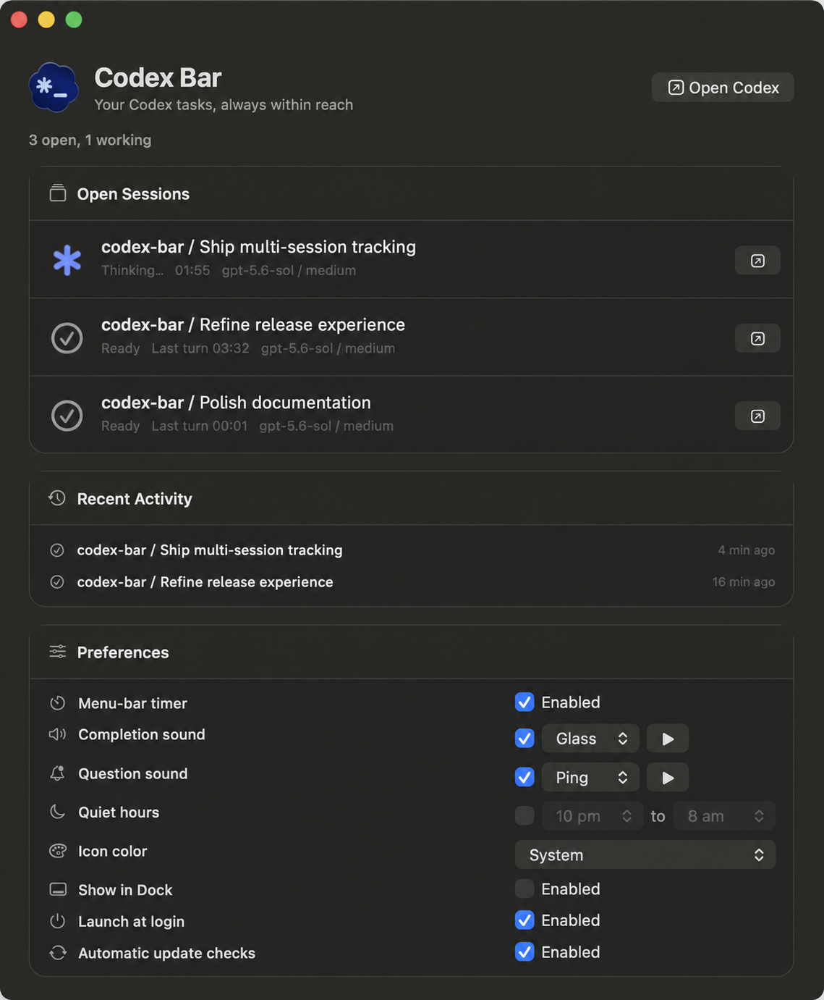
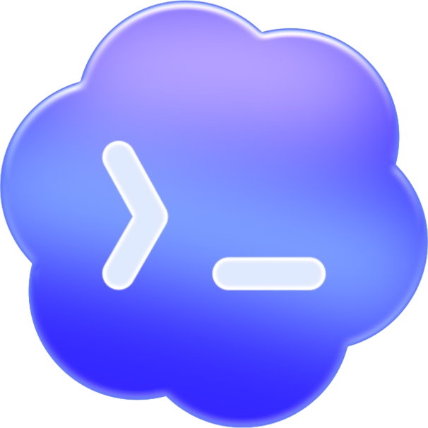

<p align="center">
  
</p>

<h1 align="center">Codex Bar</h1>

<p align="center">
  <strong>Every Codex task. One beautifully calm place.</strong><br>
  A native macOS menu-bar companion that shows what Codex is doing,<br>
  tells you when it needs you, and opens the exact task in one click.
</p>

<p align="center">
  <a href="../../releases/latest"></a>
  
  
  <a href="LICENSE"></a>
</p>

<p align="center">
  <a href="https://github.com/anes-laieb/codex-bar/issues">🐛 <strong>Issues</strong></a>
  &nbsp;&nbsp;·&nbsp;&nbsp;
  <a href="CONTRIBUTING.md">🤝 <strong>Contribution policy</strong></a>
  &nbsp;&nbsp;·&nbsp;&nbsp;
  <a href="SECURITY.md">🔒 <strong>Security</strong></a>
  &nbsp;&nbsp;·&nbsp;&nbsp;
  <a href="SUPPORT.md">💬 <strong>Support</strong></a>
  &nbsp;&nbsp;·&nbsp;&nbsp;
  <a href="CODE_OF_CONDUCT.md">🫶 <strong>Conduct</strong></a>
</p>

<p align="center">
  
</p>

<p align="center">
  <a href="../../releases/latest"><strong>Download the latest release</strong></a>
  &nbsp;&nbsp;·&nbsp;&nbsp;
  <a href="#build-from-source"><strong>Build from source</strong></a>
  &nbsp;&nbsp;·&nbsp;&nbsp;
  <a href="docs/ARCHITECTURE.md"><strong>Explore the architecture</strong></a>
</p>

> [!NOTE]
> The hero is a product illustration. The menu-bar walkthrough is rendered from the real
> 1.0.0 UI structure with demo-safe data; the window preview comes from the real app with
> private task titles replaced before publication.

## ✨ Your Codex control center

<table>
  <tr>
    <td width="33%" valign="top"><strong>See everything live</strong><br><br>Follow every currently open Codex task, including its state, elapsed time, model, effort, project, and session.</td>
    <td width="33%" valign="top"><strong>Jump to the right task</strong><br><br>Open an exact conversation through its native <code>codex://threads/{id}</code> route—no searching and no stale context.</td>
    <td width="33%" valign="top"><strong>Be interrupted intelligently</strong><br><br>Separate completion and question alerts, per-session mute controls, actionable notifications, and scheduled quiet hours.</td>
  </tr>
</table>

## 🖥️ The menu bar in action

<p align="center">
  
</p>

| Moment | What Codex Bar shows |
| --- | --- |
| **Idle** | Adaptive status artwork with no distracting text when every task is caught up. |
| **Working** | The authored animation, an optional elapsed timer, and live activity text such as `Thinking...`, all held in stable-width slots. |
| **Needs attention** | A sky-blue indicator, `Check Codex`, and a pending-task count when more than one task needs you. |
| **Menu open** | Live sessions, exact-task controls, weekly usage, New Chat, recent activity, hidden sessions, Quick Preferences, updates, and app controls. Animation and timers continue while the menu is open. |

## 🪟 The full sessions window

<p align="center">
  
</p>

### ✦ Designed around the way agents actually work

- **Multiple active sessions**, sorted by what needs attention first.
- **Pin, mute, hide, and restore** controls for individual tasks.
- **Animated live activity** with a stable timer and playful thinking verbs.
- **Actionable notifications** with **Open Task** and **Mute Session** buttons.
- **Recent activity and weekly usage** without leaving the menu bar.
- **Separate completion and question sounds**, previews, and quiet hours.
- **Default, System, and Sky Blue appearances**, plus optional Dock visibility.
- **Verified one-click updates** with download progress, SHA-256 and bundle validation,
  safe replacement, rollback protection, and an automatic relaunch.
- **No daemon and no Codex configuration edits.** The native app only reads Codex's
  local thread index and rollout logs.

### 🎨 Choose your icon color

<table>
  <tr>
    <td align="center" bgcolor="#0d1117" width="33%"><br><strong>Default</strong><br><sub>Branded full-color idle artwork</sub></td>
    <td align="center" bgcolor="#0d1117" width="33%"><br><strong>System</strong><br><sub>Follows macOS light/dark contrast</sub></td>
    <td align="center" bgcolor="#0d1117" width="33%"><br><strong>Sky Blue</strong><br><sub>Color-forward idle and working states</sub></td>
  </tr>
</table>

**System is selected by default** because its template artwork remains legible on both
light and dark menu bars. Switch instantly from **Preferences → Icon color** or the
menu-bar **Quick Preferences** submenu.

## 📦 Install

### Download the app

Download the Apple silicon DMG and its checksum from the
[latest GitHub release](../../releases/latest), then verify it:

```sh
shasum -a 256 -c Codex-Bar-1.0.0-macOS-arm64.dmg.sha256
```

Open the DMG and drag **Codex Bar.app** onto the **Applications** shortcut. The ZIP remains
available for the in-app updater and for anyone who prefers a manual archive.

The downloadable build is ad-hoc signed and is not Apple-notarized. On first launch,
macOS may ask you to confirm it through **Control-click → Open**. The release notes state
the exact architecture, minimum macOS version, signature, checksum, and source commit.

### Build from source

```sh
git clone https://github.com/anes-laieb/codex-bar.git && cd codex-bar && ./install-app.sh
```

That builds **Codex Bar.app**, puts it in `/Applications`, and launches it. The Codex
status icon appears in your menu bar and a window opens. Tick **Launch at Login** so it's
always there.

**Requirement:** Apple's Swift toolchain (already present if you have Xcode; otherwise
run `xcode-select --install` once). macOS 13+.

That's it. No Homebrew or extra apps are required.

## 🎛️ Using it

| Menu-bar state | Meaning |
| --- | --- |
| Codex idle icon | **idle**: every task is caught up |
| Animated Codex icon + timer | **working**: at least one turn is in progress |
| Sky-blue dot + `Check Codex` | **needs attention**: Codex is waiting for an answer or approval |

- **Click the menu-bar icon** for live sessions, recent activity, quick preferences, updates, and app controls.
- **Click a session** to open its exact Codex task.
- **Right-click a window session** to pin it, mute its alerts, or hide it.
- **Click the Dock icon** (or "Open Sessions Window") for the full window.
- When a turn ends or needs your answer, you get a notification and its configured sound unless alerts are muted or quiet hours are active.

### Uninstall

Quit it from its menu (or the window), then drag **`/Applications/Codex Bar.app`** to the Trash. Nothing else is left behind.

## ⚙️ How it works

Codex writes a JSON log for every session under `~/.codex/sessions/**/rollout-*.jsonl`.
Codex Bar finds the rollout files currently held open by Codex, matches them to Codex's
local thread index, tails each one, and updates the session list, icon, and notifications:

| Codex log event | State | Notification |
| --- | --- | --- |
| `task_started` | working | none |
| `task_complete` | idle | “Codex is ready” |
| `turn_aborted` | idle | none |
| *(any `*approval*` event, if present)* | needs approval | “Codex needs approval” |
| `request_user_input` | needs attention | “Codex needs attention” |

Because it reads logs (not the `notify` hook), it also catches the **“started working”**
edge that a hook can't, and it works on both the Codex **CLI** and the **Desktop** app.
Unknown events are ignored and unparsable lines are skipped, so it degrades gracefully
across Codex versions. Tested against `codex-cli 0.144.2`.

> If a future Codex release changes these events, please [open an issue](https://github.com/anes-laieb/codex-bar/issues/new/choose)
> with the Codex version, the behavior you observed, and safe reproduction details.

## 🧩 Advanced: SwiftBar/xbar plugin (optional)

Prefer to render through [SwiftBar](https://github.com/swiftbar/SwiftBar) instead of a
standalone app? There's a plugin path that uses a small background watcher + a SwiftBar
plugin, installed with `./install.sh`. See [docs](docs/) and the scripts in `bin/` and
`plugins/`. Run **either** the app **or** the plugin. `install-app.sh` stops the plugin
path automatically. There's also an optional, best-effort `notify`-hook handler
(`./install.sh --with-notify-hook`) that edits `config.toml` **only** after backing it up
and preserving any existing hook.

---

## ✅ Requirements

- **macOS 13+**
- **Swift toolchain** (Xcode or `xcode-select --install`), only needed to build.
- **Codex CLI or Codex Desktop**, which Codex Bar watches.
- The macOS-provided `lsof` and `sqlite3` command-line tools.

## 🔒 Privacy and network access

Session discovery and status processing happen locally. Codex Bar reads Codex's local
thread database and rollout logs, and stores its own preferences and recent-activity
history in macOS user defaults. It does not upload session contents.

When update checks are enabled, the app requests the latest release metadata from the
GitHub API. Clicking **Update Available** also downloads the architecture-specific ZIP
from GitHub Releases. Before installation, Codex Bar requires GitHub's SHA-256 digest,
then validates the extracted bundle identifier, version, architecture, and code signature.
No session content is included in either request. You can disable automatic metadata
checks in **Quick Preferences**.

## ⚠️ Known limitations

- **Full menu bar:** Codex Bar is a normal menu-bar item; if your menu bar is packed
  (e.g. a notched Mac), macOS may hide it. Reveal it by ⌘-dragging items apart or with a
  menu-bar manager like [Ice](https://github.com/jordanbaird/Ice).
- **Log-format dependent:** it relies on Codex's rollout-log format, which may change
  across versions (see *How it works*).
- **Writable installation required for one-click updates:** if macOS permissions prevent
  Codex Bar from replacing its installed app bundle, it preserves the current version and
  offers the GitHub release as a manual fallback.

## 🗂️ Repository layout

```
codex-bar/
├── install-app.sh          # one-command build + install of the app
├── app/
│   ├── CodexStatus.swift    # the whole app: log watcher + menu bar + window + notifications
│   ├── AppIcon.svg          # app icon (original sparkle mark)
│   ├── StatusAssets/        # app, idle-state, and animated working artwork
│   ├── Info.plist           # bundle metadata
│   └── build.sh             # compile -> "Codex Bar.app" (+ icon via built-in tools)
├── install.sh · uninstall.sh   # optional SwiftBar/watcher path
├── bin/ · plugins/ · tools/     # the SwiftBar/watcher implementation
├── docs/                        # architecture, development, and media guidance
├── CONTRIBUTING.md · CODE_OF_CONDUCT.md · SECURITY.md · SUPPORT.md
├── CHANGELOG.md · README.md · LICENSE · NOTICE
```

For implementation details, see [Architecture](docs/ARCHITECTURE.md). For local build
and verification guidance, see [Development](docs/DEVELOPMENT.md).

## 💬 Project policy and support

Issues are open for bug reports and feature requests. The project is **not accepting
code or documentation contributions at this time**, so please do not open pull requests.
Read [CONTRIBUTING.md](CONTRIBUTING.md) before participating, [SUPPORT.md](SUPPORT.md)
for help channels, and [SECURITY.md](SECURITY.md) for private vulnerability reports.

## 📄 License

[Apache-2.0](LICENSE) © the Codex Bar contributors. An independent, community project,
not affiliated with or endorsed by OpenAI; see [NOTICE](NOTICE).
