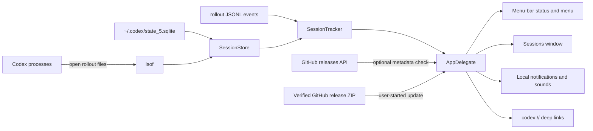

# Architecture

Codex Bar is a dependency-free AppKit application compiled from one Swift source file.
It deliberately uses macOS frameworks and command-line tools already provided by the
system, keeping local installation transparent and reproducible.

## Runtime flow

## Components

### `SessionStore`

The store locates Codex's current SQLite thread index, asks `lsof` which rollout files
are actively held open by a Codex process, joins those paths to non-archived thread rows,
and maintains the current set of trackers. It refreshes discovery at a limited cadence.

### `SessionTracker`

Each tracker seeds itself from one rollout JSONL file and then tails newly appended
bytes. It tolerates malformed or unknown records, extracts display metadata, and maps
task, approval, and `request_user_input` events to idle, working, or needs-attention
state.

### `AppDelegate`

The app delegate owns presentation and operating-system integration: the status item,
menu, sessions window, preferences, history, notification actions, sounds, Dock policy,
Launch at Login, Codex deep links, assets, update checks, and the verified in-app updater.

## Local data

| Data | Source or location | Purpose |
| --- | --- | --- |
| Thread metadata | `~/.codex/state_5.sqlite` or `~/.codex/sqlite/state_5.sqlite` | Discover open, non-archived tasks |
| Session events | `~/.codex/sessions/**/rollout-*.jsonl` | Determine task state and notification text |
| Preferences/history | macOS user defaults for `com.codexbar.app` | Remember UI, alert, session, and history choices |
| Release metadata | GitHub releases API | Optional latest-version comparison |
| Update archive | GitHub Releases | User-started, architecture-specific app update |

Codex Bar does not write to the Codex database, rollout logs, or Codex configuration.

The updater compares the downloaded archive with GitHub's SHA-256 asset digest, extracts
it into a private temporary directory, and validates the bundle identifier, release
version, executable architecture, and code signature. It stages the verified app beside
the installed copy, retains the previous bundle for rollback, and removes that backup
only after the new version launches. It never requests administrator credentials.

## Build and packaging

`app/build.sh` compiles `app/CodexStatus.swift`, assembles the `.app` bundle, copies
`StatusAssets`, generates an `.icns` file with built-in macOS image tools, and applies
an ad-hoc signature. `install-app.sh` selects `/Applications` or `~/Applications`, removes
an older local installation, copies the new bundle, and launches it.

`scripts/package-release.sh` builds the signed bundle once and emits both release formats:
the ZIP consumed by the verified in-app updater and a compressed DMG with the conventional
drag-to-Applications layout. Each artifact is published with its own SHA-256 checksum.

The legacy SwiftBar path under `bin/`, `plugins/`, and `tools/` is separate from the
native app. Users should run only one path at a time.
